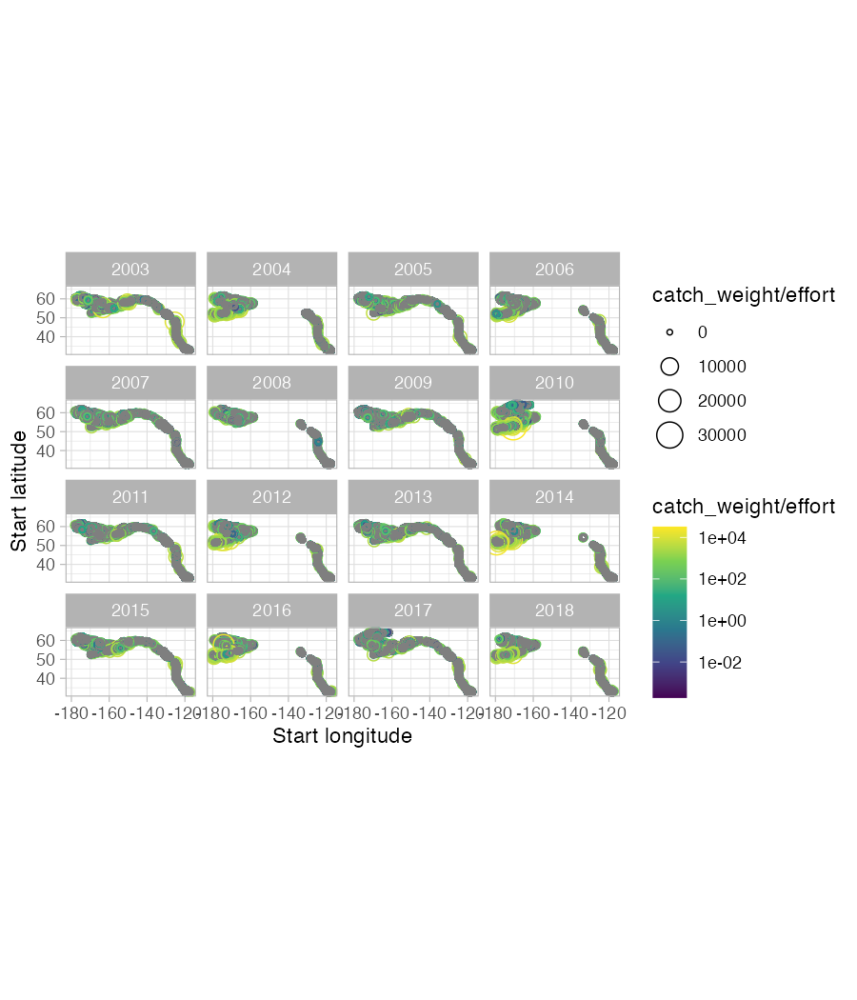

```{r, include = FALSE}
knitr::opts_chunk$set(
  collapse = TRUE,
  comment = "#>"
)
```

This vignette represents an introduction to using the `surveyjoin` package. We'll load the package, along with `dplyr` and `ggplot2` for data manipulation and plotting.

```{r setup}
library(surveyjoin)
library(dplyr)
library(ggplot2)
```

The `surveyjoin` package contains several processing functions that will download the survey data files locally, and create a connection to the SQLite database. The `cache_data()` function takes 5-10 minutes to run, and needs to be only run every time the raw data is refreshed (a new year of survey data becomes available).

```{r get-data, eval=FALSE}
cache_data()
load_sql_data()
```

Several helper functions have been included to provide more information on the metadata, survey shapefiles, and links to the original data. Each of these returns a dataframe with a URL for each of our three regions ("afsc", "pbs", "nwfsc").

```{r eval=FALSE}
get_metadata()
get_shapefiles()
get_rawdata()
```

Additionally, we can look at the table of species names (common, scientific, itis) that are included. 

```{r eval=FALSE}
get_species()
```


The core function of the package is `get_data`. This allows for querying by species (using common names - "common", scientific names - "scientific", or ITIS identifiers - "itis_id"), regions, surveys, or years -- each of these may be a single value or vector of values. We could get data for sablefish from all Alaska surveys in the the last decade with

```{r eval=FALSE}
d <- get_data(common = "sablefish", years = 2013:2023, regions = "afsc")
```

As a second example, we could get data coastwide for Arrowtooth flounder and plot it with the following code. We'll constrain it to years 2003-2018 for plotting purposes (though the earliest year of data is 1980).

```{r, eval=FALSE}
d <- get_data(common = "arrowtooth flounder", years = 2003:2018)

g <- d |>
  ggplot(aes(
    lon_start,
    lat_start,
    colour = catch_weight / effort,
    size = catch_weight / effort
  )) +
  geom_point(pch = 21) +
  facet_wrap(~year) +
  scale_colour_viridis_c(trans = "log10") +
  theme_light() +
  coord_fixed() +
  xlab("Start longitude") +
  ylab("Start latitude")

ggsave(g,
  filename = "map-example.png",
  width = 6, height = 7, dpi = 150
)
```



```{r echo=FALSE}
# knitr::include_graphics("map-example.png")
```

Additional information on specific species can be found in our species dictionary

```{r eval=FALSE}
data("spp_dictionary")
```

And the full list of survey names can be found with

```{r}
get_survey_names()
```


